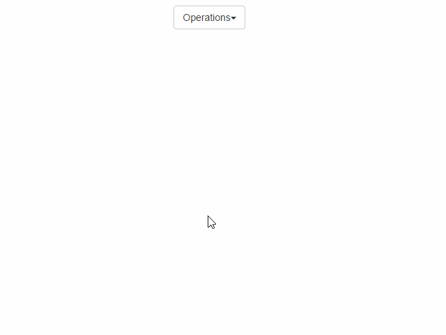

jquery.aim
==========

jQuery plugin anticipates on which element user is going to hover/click.



## Examples
A couple of examples can be found the [examples page](http://cihadturhan.github.io/jquery-aim/examples/index.html)

## Usage
Call the function on the elements to catch user aim and add a class which will be added or removed when aiming starts or ends
```javascript
$('#target').aim({
    className: 'open'
});
```

If you want to execute a function on aim starts or ends, use the `aimEnter` and `aimExit` options
```javascript
$('#hamburger').aim({

    aimEnter: function() {
        $('#menu').show();
    },

    aimExit: function(){
        $('#menu').hide();
    }
});

```


## Debugging
To see where your cursor is aiming and check if it intersects with elements use
```javascript
$.aim.setDebug(true);
```
and you will see a rectangle moving around.

## Defining own function
If you don't like the default algorithm, define your own by the following procedure

```javascript


function anticipateFunc(p, v, mouseX, mouseY, anticipator) {
  /*
  Calculate the new position of anticipator using inputs
  p = {x:number,y:number}
  v = {x:number,y:number}
  mouseX = number
  mouseY = number

  Anticipator has some readonly values like the following

  {
      size: 50,
      center: {x: 0, y: 0},
      effectiveSize: 1,
      rect : {x0: 0, y0: 0, x1: 50, y1: 50}
  }

  */
}

$.aim.setAnticipateFunction(anticipateFunc);

```
